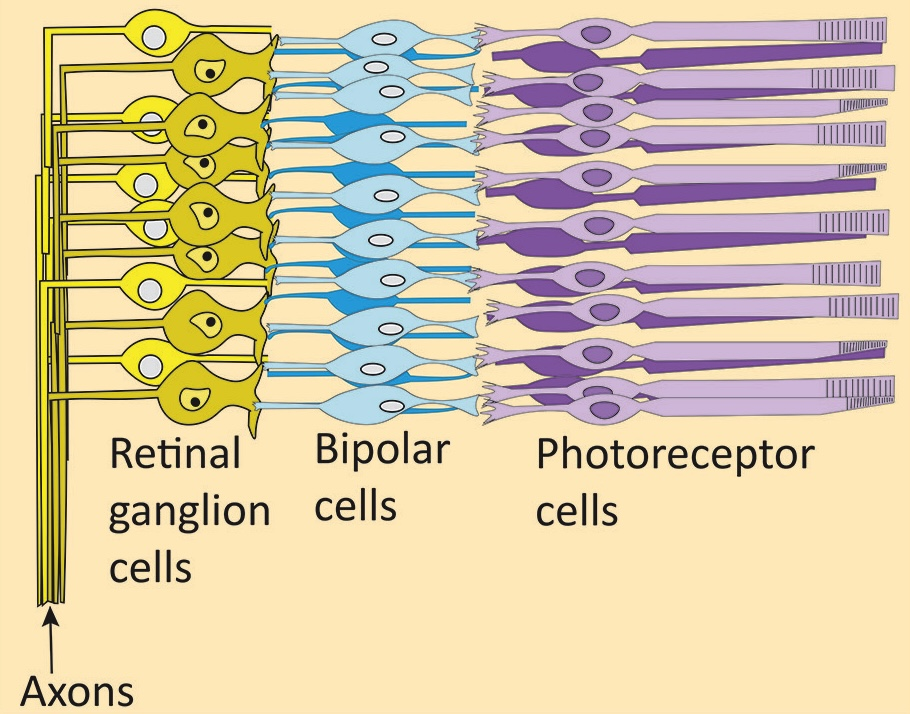
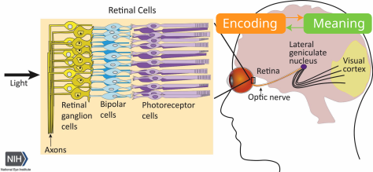
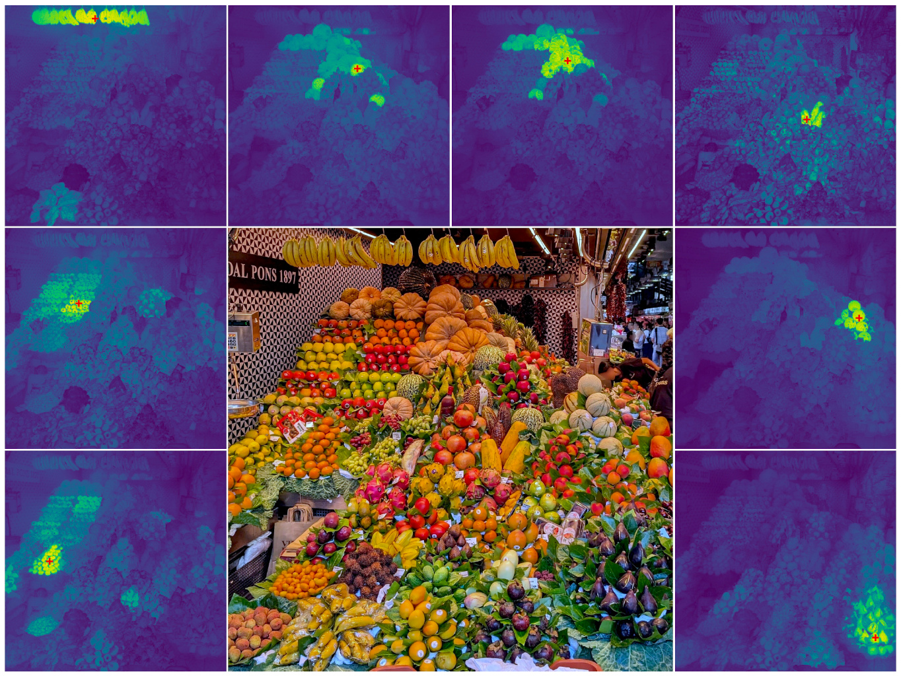
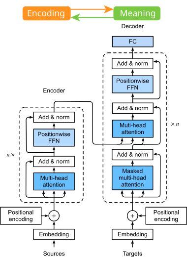
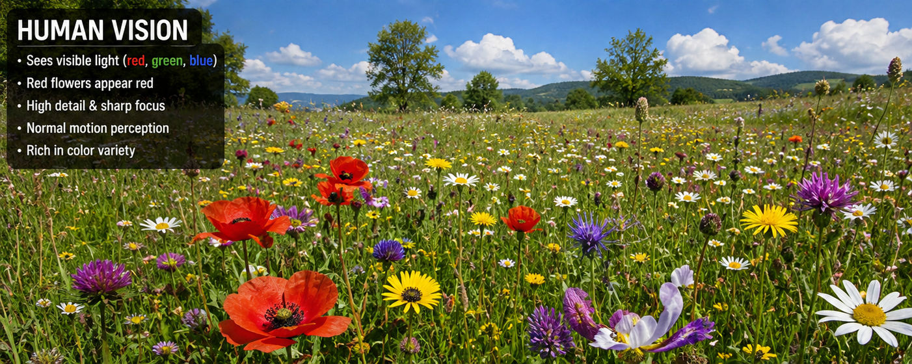
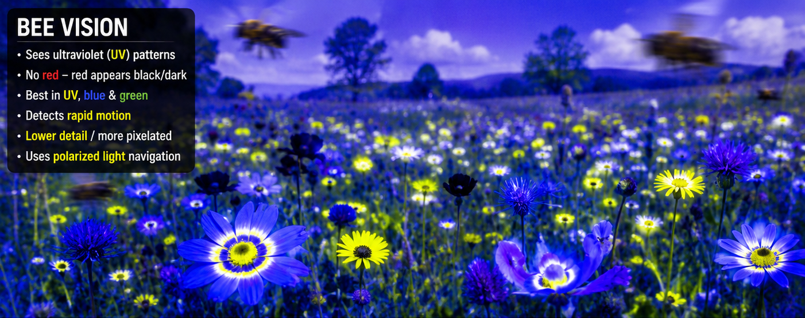
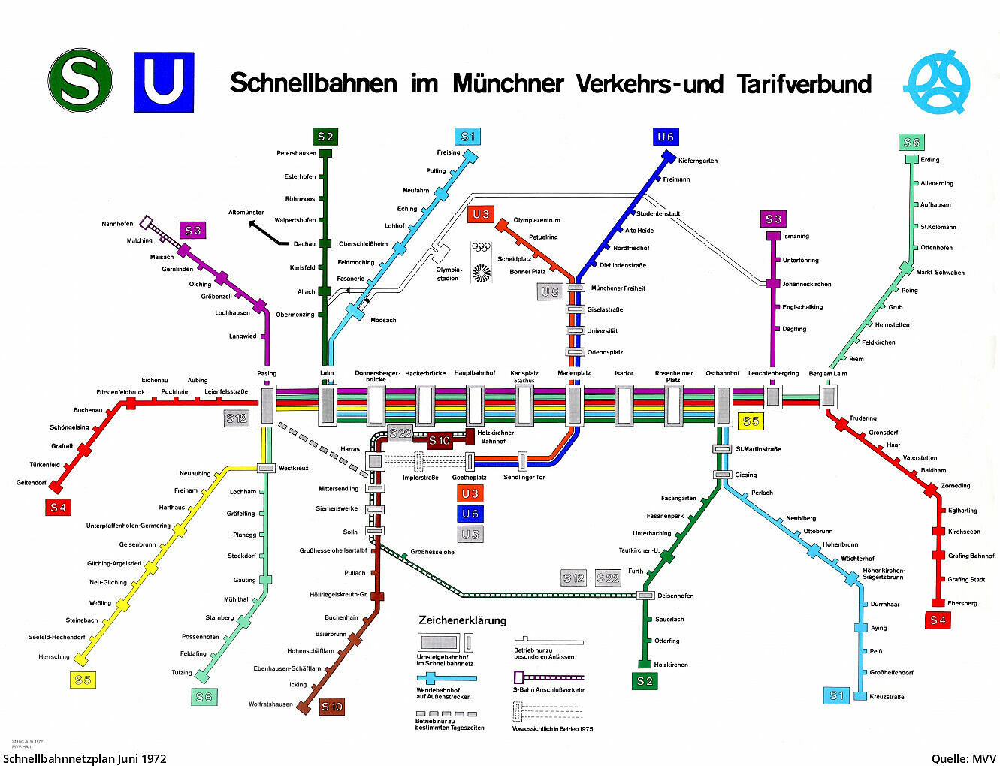
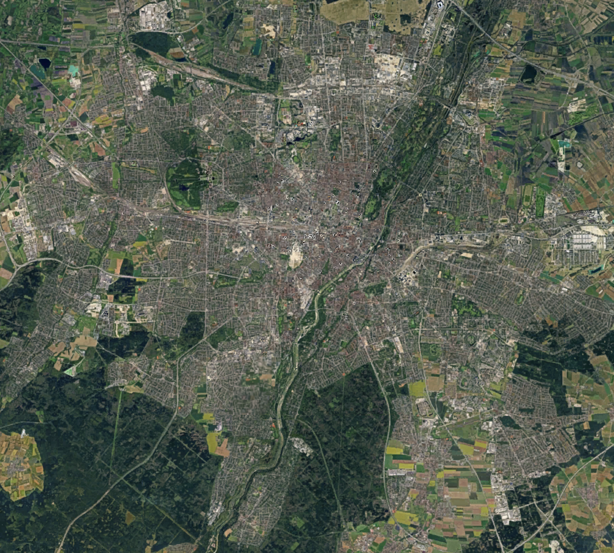

---
addons:
  - "../"
defaults:
  layout: bonn-content
layout: bonn-cover
subhead: Lecture 1
home: ../
---

# Geospatial Representation Learning

Lecture 1

---
section: opening
sectionTitle: Opening
---

# Let's think about an Apple

### 

  

    
    
    
    
    
    
    
    
  

  

    

      <blockquote v-click="5" class="blockquote2 !m-0 flex h-full items-center text-[1.05rem] leading-snug">
        The same object can be represented in many ways.
        A good representation makes useful structure visible and computation easier.
      </blockquote>
    

    

      <blockquote v-click="10" class="blockquote3 !m-0 flex h-full items-center text-[1.05rem] leading-snug">
        But representation is not only encoding. 
        Representation is also meaning.
      </blockquote>
    

  

---
section: opening
sectionTitle: Opening
---

# Our Vision is Edge Enhanced

  

    

      Retinal cells implement an
      <a href="https://en.wikipedia.org/wiki/Edge_detection" target="_blank" rel="noopener noreferrer">edge filter</a>
      through
      <a href="https://en.wikipedia.org/wiki/Lateral_inhibition" target="_blank" rel="noopener noreferrer">lateral inhibition</a>.
    

    
  

  

    

      Mach Bands - Optical Illusion (Mach, 1865)
    

    

      

        
222

        
198

        
173

        
148

      

      

        

          
222

          
198

          
173

          
148

        

      

    

  

<blockquote v-click="2" class="blockquote1">
Our eyes has built-in edge detectors that inhibit the response from neighboring cells.
</blockquote>

  <a href="https://pmc.ncbi.nlm.nih.gov/articles/PMC1350218/pdf/jphysiol00969-0168.pdf" target="_blank" rel="noopener noreferrer">
    Shapley, R. M., &amp; Tolhurst, D. J. (1973). Edge detectors in human vision. <em>Journal of Physiology</em>, 229, 165-183.
  </a>

---
section: opening
sectionTitle: Opening
---

# Human Vision System merges Encoding and Representation

  

  <a href="https://www.nih.gov/news-events/news-releases/nih-researchers-identify-brain-circuits-responsible-visual-acuity" target="_blank" rel="noopener noreferrer">
    Yang, J., et al. (2025). Differential impact of retinal lesions on visual responses of LGN X and Y cells. <em>The Journal of Neuroscience</em>. DOI: 10.1523/JNEUROSCI.0436-25.2025.
  </a>

--- 
section: opening
sectionTitle: Opening
---

# The Monkey Business Illusion

###

  <iframe
    class="h-[330px] w-full max-w-[740px] rounded-xl shadow"
    src="https://www.youtube.com/embed/IGQmdoK_ZfY?rel=0&modestbranding=1"
    title="The Monkey Business Illusion"
    frameborder="0"
    allow="accelerometer; autoplay; clipboard-write; encrypted-media; gyroscope; picture-in-picture; web-share"
    allowfullscreen>
  </iframe>

  <a href="https://doi.org/10.1068/i0386" target="_blank" rel="noopener noreferrer">
    Simons, D. J. (2010). Monkeying around with the gorillas in our midst: Familiarity with an inattentional-blindness task does not improve the detection of unexpected events. <em>i-Perception</em>. https://doi.org/10.1068/i0386
  </a>

---
section: opening
sectionTitle: Opening
---

# Feed-forward Convolutional Neural Networks

  

<blockquote class="blockquote1">
Early Deep Neural Networks similarly encode low-level representations to extract more high-level meaning in vectors and matrices.
</blockquote>

  <a href="http://vision.stanford.edu/cs598_spring07/papers/Lecun98.pdf" target="_blank" rel="noopener noreferrer">
    LeCun, Y., Bottou, L., Bengio, Y., &amp; Haffner, P. (1998). Gradient-based learning applied to document recognition. <em>Proceedings of the IEEE</em>, 86(11), 2278-2324.
  </a>

---
section: opening
sectionTitle: Opening
---

# Attention: global meaning to local encoding

  
  

  <a href="https://arxiv.org/abs/2508.10104" target="_blank" rel="noopener noreferrer">
    Siméoni, O., et al. (2025). DINOv3. <em>arXiv:2508.10104</em>.
  </a>
   
  <a href="https://d2l.ai/chapter_attention-mechanisms-and-transformers/index.html" target="_blank" rel="noopener noreferrer">
    Zhang, A., Lipton, Z. C., Li, M., &amp; Smola, A. J. Dive into Deep Learning: Attention Mechanisms and Transformers.
  </a>

---
section: opening
sectionTitle: Opening
---

# The representation depends on the Problem

###

  

    
    
  

  

    

      <blockquote v-click="1" class="blockquote1 !m-0 flex h-full items-center text-[1.05rem] leading-snug">
        A useful representation depends on the problem we are trying to solve.
      </blockquote>
    

    

      <blockquote v-click="2" class="blockquote2 !m-0 flex h-full items-center text-[1.05rem] leading-snug">
        Bees see ultraviolet patterns that humans miss, because their visual system is tuned to different tasks.
      </blockquote>
    

  

---
section: opening
sectionTitle: Opening
---

# Choosing Good Representations Matters

## Examples

  

    <h3>Images</h3>
    <AppleMatrixRepresentation :click-index="1" />
  

  

    <h3>Math</h3>
    

      

        

          XLVII + LXXVIII = ?
        

        

          47 + 78 = 125
        

      

    

  

  

    <h3>Places</h3>
    

      

        Coordinates
      

      

        50°43′57.73″ N, 
        7°06′16.63″ E
      

      

        

          Place
        

        

          Hofgarten, Bonn, Germany
        

      

    

  

---
section: opening
sectionTitle: Opening
---

# Representations of Geospatial Information

## Same city, different maps

  
  
  

<blockquote v-click class="blockquite1">
We need to select or learn a suitable representation for the problem-at-hand.
</blockquote>

---
section: opening
sectionTitle: Opening
---

# Choosing or Learning Representations

<h3>Designed representations</h3>

We choose structures that make operations easier.

  

<h3>Learned representations</h3>

We train models to discover useful structure.

  

<blockquote v-click="3" class="blockquote1 text-center">
This course focuses on learning representations. 
</blockquote>

---
section: opening
sectionTitle: Opening
---

# Sections of this Lecture

<h3>Mental representations </h3>

Human memories, intuitions, expectations, and place knowledge built from experience.

<h3>Geospatial representations </h3>

Rasters, vectors, polygons, and geodata layers that encode explicit spatial structure.

<h3>Neural representations </h3>

World knowledge stored in AI parameters and activated through learned latent features.

  <a href="https://www.sueddeutsche.de/muenchen/mental-maps-die-stadt-in-meinem-kopf-1.3087218" target="_blank" rel="noopener noreferrer">
    Die Stadt in meinem Kopf. (2016). <em>Süddeutsche Zeitung</em>.
  </a>

---
layout: bonn-section
sectionColor: "#00457c"
section: mental-representations
sectionTitle: Mental Representations
---

# Mental Representations

<a href="https://www.sueddeutsche.de/muenchen/mental-maps-die-stadt-in-meinem-kopf-1.3087218" target="_blank" rel="noopener noreferrer">
Die Stadt in meinem Kopf. (2016). <em>Süddeutsche Zeitung</em>.
</a>

---
section: mental-representations
sectionTitle: Mental Representations
---

# Task: Think of a place

## Think of a place you visited on vacation.
Not the country or city name first — think of the actual place.
What do you remember?

  
  

<blockquote v-click>
We feel mental representations as "intuitions" and "memories" of things/places.
</blockquote>

  <a href="https://pmc.ncbi.nlm.nih.gov/articles/PMC3789138/" target="_blank" rel="noopener noreferrer">
    Preston, A. R., &amp; Eichenbaum, H. (2013). Interplay of hippocampus and prefrontal cortex in memory. <em>Current Biology</em>, 23(17), R764-R773.
  </a>

---
section: mental-representations
sectionTitle: Mental Representations
---

# Geology: Where can we find this Rock?

  

  <iframe
    class="h-[340px] aspect-[9/16] rounded-xl shadow"
    src="https://www.youtube.com/embed/OV6SYabHM_w?rel=0&modestbranding=1"
    title="GeoGuessr example"
    frameborder="0"
    allow="accelerometer; autoplay; clipboard-write; encrypted-media; gyroscope; picture-in-picture"
    allowfullscreen>
  </iframe>

---
section: mental-representations
sectionTitle: Mental Representations
---

# History: When was this city founded?

  

  

    

      
      282 CE (Roman/Antique)
    

    

      
      1153 CE (Midieval)
    

    

      
      1593 CE (Renaissance)
      

        ✓
        1593 CE (Renaissance)
      

    

    

      
      1975 CE (Modern)
    

  

  

    
  

---
section: mental-representations
sectionTitle: Mental Representations
---

# Livability: How livable is this neighborhood?

  

  

    

      
      simple
    

    

      
      middle
    

    

      
      good
      

        ✓
        good
      

    

    

      
      very good
    

  

  <blockquote v-click>
    Based on which features in the image, and based on what world knowledge, did you decide?
  </blockquote>

---
section: mental-representations
sectionTitle: Mental Representations
---

# Livability: How livable is this neighborhood?

  

  

    

      
      simple
    

    

      
      middle
    

    

      
      good
    

    

      
      very good
      

        ✓
        very good
      

    

  

  <blockquote v-click>
    Based on which features in the image, and based on what world knowledge, did you decide?
  </blockquote>

---
section: mental-representations
sectionTitle: Mental Representations
---

# Livability: Qualitative and Quantitative Factors

The residential location map has four levels: **simple**, **middle**, **good**, and **very good**.

It takes into account:

- Infrastructure
- Urban green space
- **Streetscape**
- Transport connection
- Appreciation
- Burden
- Centrality

  

  <a href="https://gutachterausschuss.bonn.de/produkte/wohnlagen-mietspiegel.php" target="_blank" rel="noopener noreferrer">
    Wohnlagen/Mietspiegel. Gutachterausschuss Bonn 2023.
  </a>

---
section: mental-representations
sectionTitle: Mental Representations
---

# Biodiversity: Which Agriculural Landscape supports more Diverse Bird Populations?

  

  

    

      
      France
      

        ✓
        France
      

    

    

      
      Switzerland
    

  

  <blockquote v-click>
    The border region between Switzerland (right) and France (left) at Chavannes-des-Bois, near Lake Geneva. Swiss fields and forests seem very artificial, while French landscapes are uneven and broken up by hedges and smooth forest transitions.
  </blockquote>

  <a href="https://www.sciencedirect.com/science/article/pii/S0921800923001179" target="_blank" rel="noopener noreferrer">
    Engist, D., Finger, R., Knaus, P., Guélat, J., &amp; Wuepper, D. (2023). Agricultural systems and biodiversity: evidence from European borders and bird populations. <em>Ecological Economics</em>, 209, 107854.
  </a>

---
section: mental-representations
sectionTitle: Mental Representations
---

# How do we recognize places?

We infer location from many weak cues.

  

    
🌿

    
vegetation

  

  

    
🛣️

    
road markings

  

  

    
🏘️

    
architecture

  

  

    
🪧

    
signs and language

  

  

    
⛰️

    
terrain

  

  

    
🌦️

    
climate

  

  

    
🚉

    
infrastructure

  

<blockquote v-click>
We do not recognize places from one signal. We combine many imperfect signals into a coherent spatial intuition.
</blockquote>

---
section: mental-representations
sectionTitle: Mental Representations
---

# A place is more than a coordinate

## Coordinate

50.7374° N, 7.0982° E

  
reference

  
position

  
index

## Place

  
home

  
routes

  
landmarks

  
memories

  
context

  
meaning

<blockquote>
A coordinate tells us where something is. A representation tells us what that place means.
</blockquote>

---
section: mental-representations
sectionTitle: Mental Representations
---

# Takeaways Mental Representations

<h3>Mental representations </h3>

Human memories, intuitions, expectations, and place knowledge built from experience.

  <a href="https://www.sueddeutsche.de/muenchen/mental-maps-die-stadt-in-meinem-kopf-1.3087218" target="_blank" rel="noopener noreferrer">
    Die Stadt in meinem Kopf. (2016). <em>Süddeutsche Zeitung</em>.
  </a>

---
section: geospatial-representations
sectionTitle: Geospatial Representations
---

# Geospatial representations

<h3>Mental representations </h3>

Human memories, intuitions, expectations, and place knowledge built from experience.

<h3>Geospatial databases </h3>

Rasters, vectors, polygons, and geodata layers that encode explicit spatial structure.

  <a href="https://www.sueddeutsche.de/muenchen/mental-maps-die-stadt-in-meinem-kopf-1.3087218" target="_blank" rel="noopener noreferrer">
    Die Stadt in meinem Kopf. (2016). <em>Süddeutsche Zeitung</em>.
  </a>

---
layout: bonn-cover
subhead: Practical 1
home: ../
---

# Exploring Geospatial Representations

## Geospatial Representation Learning
