---
addons:
  - "../"
defaults:
  layout: bonn-content
layout: bonn-cover
subhead: Lecture 1
home: ../
---

# Geospatial Representation Learning

## Making AI location-aware

Lecture 1 — Why do we need a new field?

<!--
Open by framing the course as a bridge: human place intuition, formal GIS, and modern AI representations.
-->

---

# Representations of Geospatial Information

<h3>Mental representations </h3>
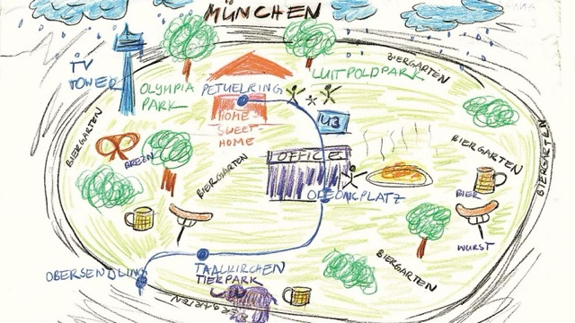

Human memories, intuitions, expectations, and place knowledge built from experience.

<h3>Geospatial databases </h3>
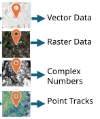

Rasters, vectors, polygons, and geodata layers that encode explicit spatial structure.

<h3>Neural representations </h3>

World knowledge stored in AI parameters and activated through learned latent features.

  <a href="https://www.sueddeutsche.de/muenchen/mental-maps-die-stadt-in-meinem-kopf-1.3087218" target="_blank" rel="noopener noreferrer">
    Die Stadt in meinem Kopf. (2016). <em>Süddeutsche Zeitung</em>.
  </a>

---
layout: bonn-section
sectionColor: "#00457c"
section: mental-representations
sectionTitle: Mental Representations
---

# Mental Representations

<a href="https://www.sueddeutsche.de/muenchen/mental-maps-die-stadt-in-meinem-kopf-1.3087218" target="_blank" rel="noopener noreferrer">
Die Stadt in meinem Kopf. (2016). <em>Süddeutsche Zeitung</em>.
</a>

---
section: mental-representations
sectionTitle: Mental Representations
---

# Task: Think of a place

## Think of a place you visited on vacation.
Not the country or city name first — think of the actual place.
What do you remember?

  
  

<blockquote v-click>
We feel mental representations as "intuitions" and "memories" of things/places.
</blockquote>

  <a href="https://pmc.ncbi.nlm.nih.gov/articles/PMC3789138/" target="_blank" rel="noopener noreferrer">
    Preston, A. R., &amp; Eichenbaum, H. (2013). Interplay of hippocampus and prefrontal cortex in memory. <em>Current Biology</em>, 23(17), R764-R773.
  </a>

---
section: mental-representations
sectionTitle: Mental Representations
---

# Geology: Where can we find this Rock?

  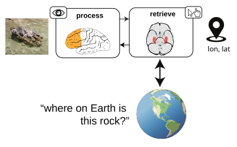

  <iframe
    class="h-[340px] aspect-[9/16] rounded-xl shadow"
    src="https://www.youtube.com/embed/OV6SYabHM_w?rel=0&modestbranding=1"
    title="GeoGuessr example"
    frameborder="0"
    allow="accelerometer; autoplay; clipboard-write; encrypted-media; gyroscope; picture-in-picture"
    allowfullscreen>
  </iframe>

---
section: mental-representations
sectionTitle: Mental Representations
---

# History: When was this city founded?

  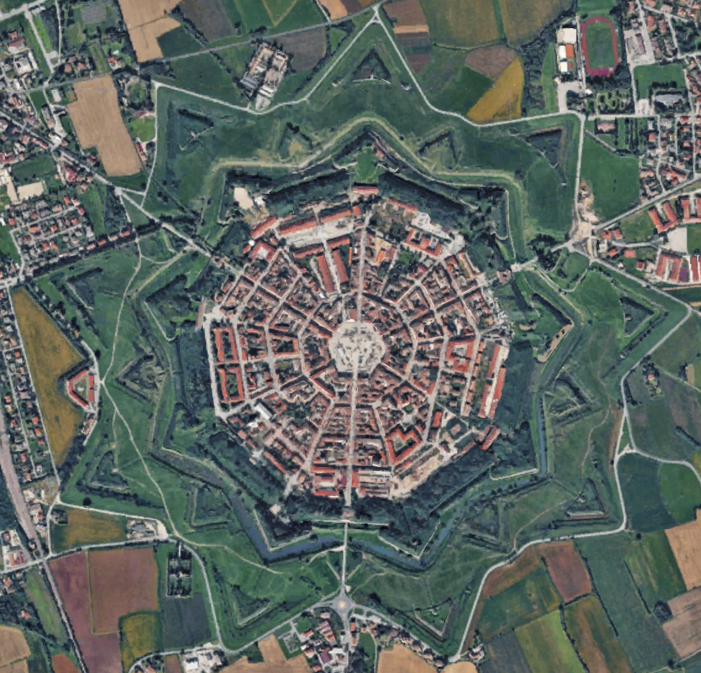

  

    

      
      282 CE (Roman/Antique)
    

    

      
      1153 CE (Midieval)
    

    

      
      1593 CE (Renaissance)
      

        ✓
        1593 CE (Renaissance)
      

    

    

      
      1975 CE (Modern)
    

  

  

    
  

---
section: mental-representations
sectionTitle: Mental Representations
---

# Livability: How livable is this neighborhood?

  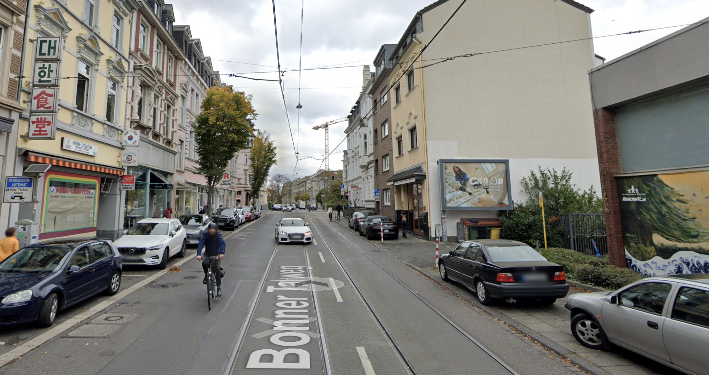

  

    

      
      simple
    

    

      
      middle
    

    

      
      good
      

        ✓
        good
      

    

    

      
      very good
    

  

  <blockquote v-click>
    Based on which features in the image, and based on what world knowledge, did you decide?
  </blockquote>

---
section: mental-representations
sectionTitle: Mental Representations
---

# Livability: How livable is this neighborhood?

  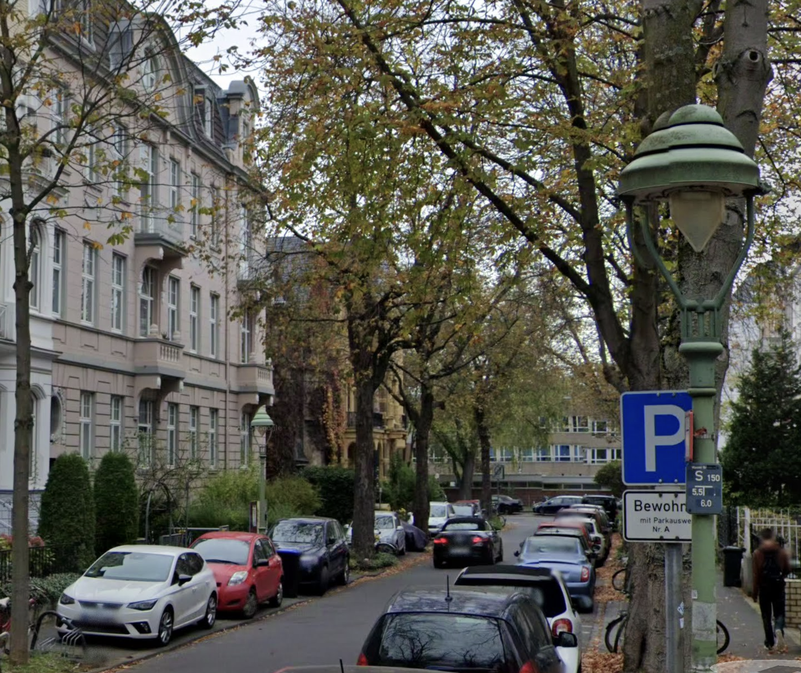

  

    

      
      simple
    

    

      
      middle
    

    

      
      good
    

    

      
      very good
      

        ✓
        very good
      

    

  

  <blockquote v-click>
    Based on which features in the image, and based on what world knowledge, did you decide?
  </blockquote>

---
section: mental-representations
sectionTitle: Mental Representations
---

# Livability: Qualitative and Quantitative Factors

The residential location map has four levels: **simple**, **middle**, **good**, and **very good**.

It takes into account:

- Infrastructure
- Urban green space
- **Streetscape**
- Transport connection
- Appreciation
- Burden
- Centrality

  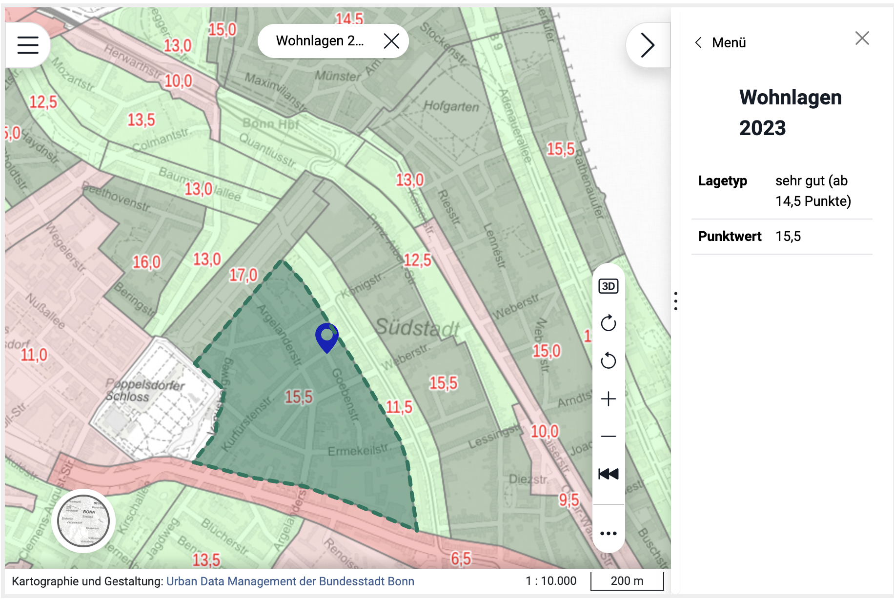

  <a href="https://gutachterausschuss.bonn.de/produkte/wohnlagen-mietspiegel.php" target="_blank" rel="noopener noreferrer">
    Wohnlagen/Mietspiegel. Gutachterausschuss Bonn 2023.
  </a>

---
section: mental-representations
sectionTitle: Mental Representations
---

# Biodiversity: Which Agriculural Landscape supports more Diverse Bird Populations?

  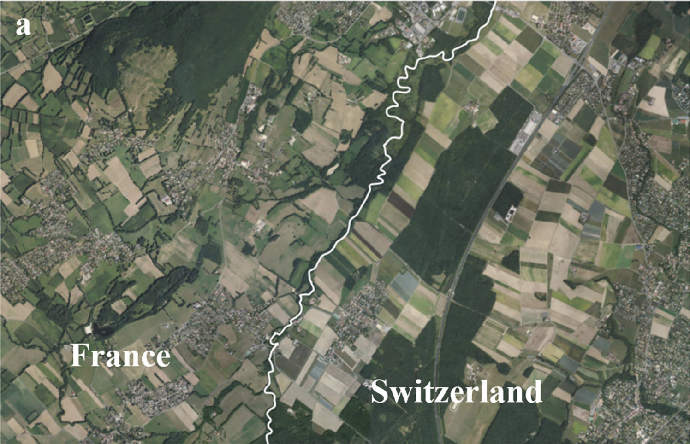

  

    

      
      France
      

        ✓
        France
      

    

    

      
      Switzerland
    

  

  <blockquote v-click>
    The border region between Switzerland (right) and France (left) at Chavannes-des-Bois, near Lake Geneva. Swiss fields and forests seem very artificial, while French landscapes are uneven and broken up by hedges and smooth forest transitions.
  </blockquote>

  <a href="https://www.sciencedirect.com/science/article/pii/S0921800923001179" target="_blank" rel="noopener noreferrer">
    Engist, D., Finger, R., Knaus, P., Guélat, J., &amp; Wuepper, D. (2023). Agricultural systems and biodiversity: evidence from European borders and bird populations. <em>Ecological Economics</em>, 209, 107854.
  </a>

---
section: mental-representations
sectionTitle: Mental Representations
---

# How do we recognize places?

We infer location from many weak cues.

  

    
🌿

    
vegetation

  

  

    
🛣️

    
road markings

  

  

    
🏘️

    
architecture

  

  

    
🪧

    
signs and language

  

  

    
⛰️

    
terrain

  

  

    
🌦️

    
climate

  

  

    
🚉

    
infrastructure

  

<blockquote v-click>
We do not recognize places from one signal. We combine many imperfect signals into a coherent spatial intuition.
</blockquote>

---
section: mental-representations
sectionTitle: Mental Representations
---

# A place is more than a coordinate

## Coordinate

50.7374° N, 7.0982° E

  
reference

  
position

  
index

## Place

  
home

  
routes

  
landmarks

  
memories

  
context

  
meaning

<blockquote>
A coordinate tells us where something is. A representation tells us what that place means.
</blockquote>

---
section: mental-representations
sectionTitle: Mental Representations
---

# Takeaways Mental Representations

<h3>Mental representations </h3>

Human memories, intuitions, expectations, and place knowledge built from experience.

  <a href="https://www.sueddeutsche.de/muenchen/mental-maps-die-stadt-in-meinem-kopf-1.3087218" target="_blank" rel="noopener noreferrer">
    Die Stadt in meinem Kopf. (2016). <em>Süddeutsche Zeitung</em>.
  </a>

---
section: geospatial-representations
sectionTitle: Geospatial Representations
---

# Geospatial representations

<h3>Mental representations </h3>

Human memories, intuitions, expectations, and place knowledge built from experience.

<h3>Geospatial databases </h3>

Rasters, vectors, polygons, and geodata layers that encode explicit spatial structure.

  <a href="https://www.sueddeutsche.de/muenchen/mental-maps-die-stadt-in-meinem-kopf-1.3087218" target="_blank" rel="noopener noreferrer">
    Die Stadt in meinem Kopf. (2016). <em>Süddeutsche Zeitung</em>.
  </a>

---
layout: bonn-section
sectionColor: "#f2c300"
section: geospatial-data-representations
sectionTitle: Geospatial Data Representations
---

# Geospatial Data Representations

<a href="https://saylordotorg.github.io/text_essentials-of-geographic-information-systems/s05-03-geographic-information-systems.html" target="_blank" rel="noopener noreferrer">
Campbell &amp; Shin (2011), Figure 1.8.
</a>

---

# Coordinates and Location

<blockquote>
How many coordinates do we need to uniquely define a spatio-temporal location?
</blockquote>

---

# Cartesian Coordinates

  

  A location can be represented by three orthogonal coordinates:
  

  $$
  \mathbf{p} = (x, y, z)
  $$

  $$
  x, y, z \in \mathbb{R}
  $$

  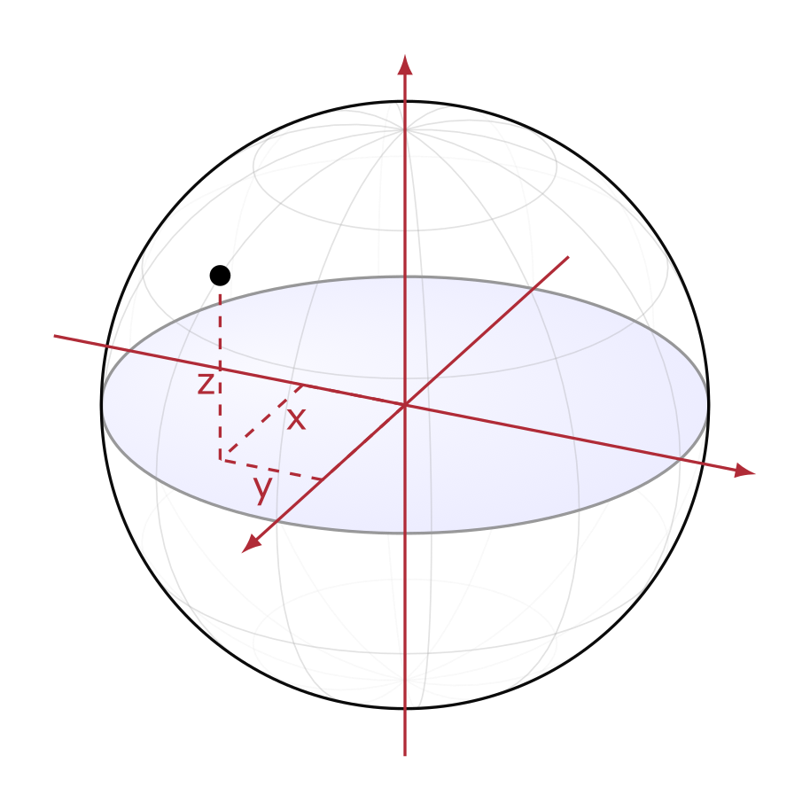

---

# Spherical Coordinates

Spherical to Cartesian

$$
x = r \cos\varphi \cos\lambda
$$

$$
y = r \cos\varphi \sin\lambda
$$

$$
z = r \sin\varphi
$$

Cartesian to spherical

$$
r = \sqrt{x^2 + y^2 + z^2}
$$

$$
\lambda = \operatorname{atan2}(y, x)
$$

$$
\varphi = \arcsin\left(\frac{z}{r}\right)
$$

  
λ = longitude

  
φ = latitude

  
r = constant Earth radius

  

---

# Ellipsoidal Coordinates

Geodetic to Cartesian

$$
\begin{aligned}
x &= (N(\varphi) + h)\cos\varphi\cos\lambda \\
y &= (N(\varphi) + h)\cos\varphi\sin\lambda \\
z &= \left((1-e^2)N(\varphi) + h\right)\sin\varphi
\end{aligned}
$$

$$
\begin{aligned}
N(\varphi) &= \frac{a}{\sqrt{1-e^2\sin^2\varphi}} \\
e^2 &= \frac{a^2-b^2}{a^2}
\end{aligned}
$$

Cartesian to Geodetic

The inverse is usually computed iteratively. See
<a href="https://en.wikipedia.org/wiki/Geographic_coordinate_conversion#From_ECEF_to_geodetic_coordinates" target="_blank" rel="noopener noreferrer">
Wikipedia
</a>.

  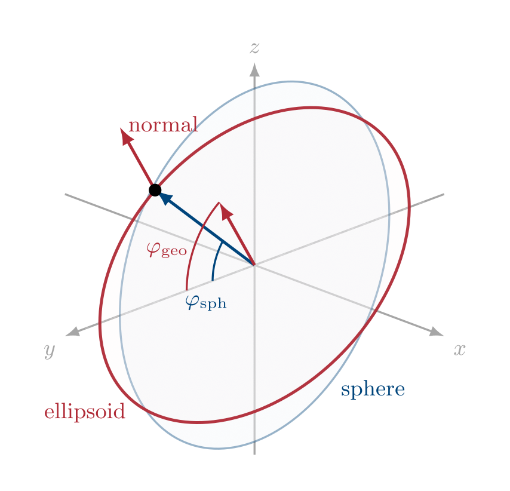

--- 

# World Geodetic System 1984 (WGS 84)

WGS 84 is the global reference system used by GPS and most web mapping workflows.

  

---

# Cylindrical Map Projections and UTM

### Cylindrical projections

A cylinder touches or cuts the globe along a line or lines. The classic case is a cylinder around the equator.

  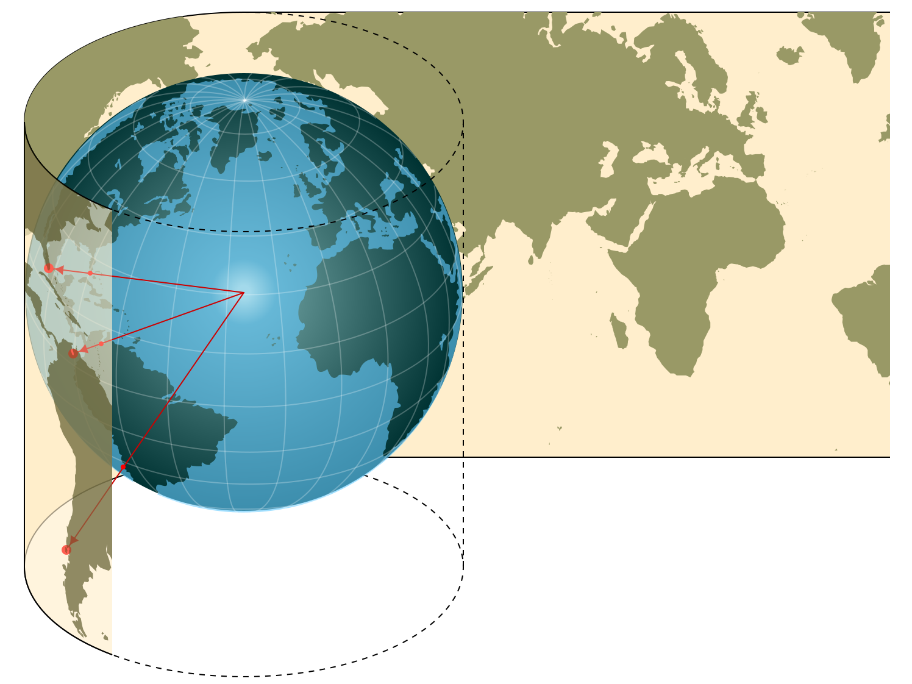

<blockquote style="margin-top: auto;">
Cylindrical projections minimize distortion along their standard line(s).
</blockquote>

### Universal Transverse Mercator (UTM)

The Universal Transverse Mercator system rotates this idea: each zone uses a transverse cylinder around a local central meridian.

  

  
  

  

  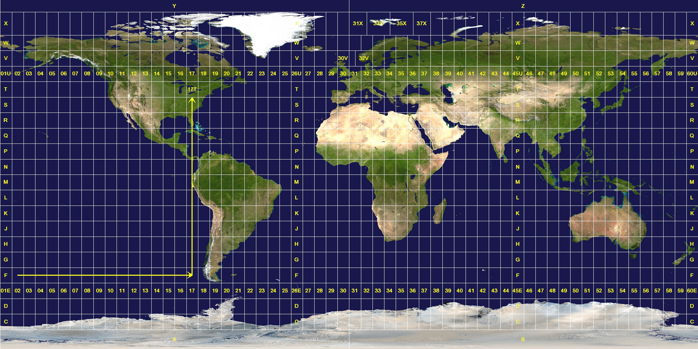
  

<blockquote style="margin-top: auto;">
UTM turns longitude/latitude into local metric coordinates: easting and northing.
</blockquote>

---

# Time

  

---
layout: bonn-cover
subhead: Practical 1
home: ../
---

# Exploring Geospatial Representations

## Geospatial Representation Learning
