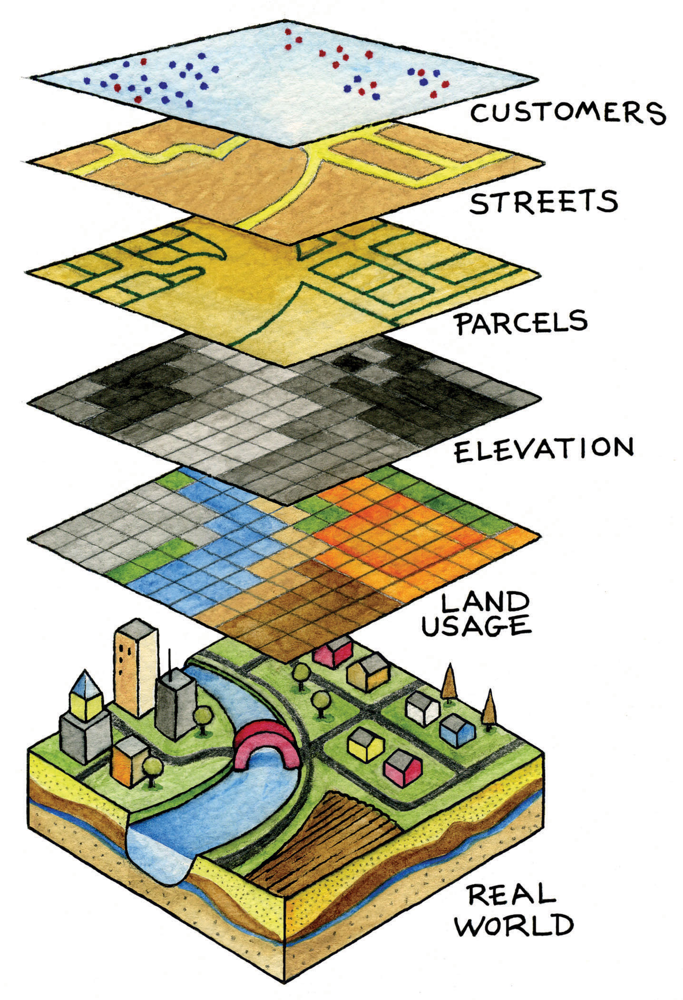
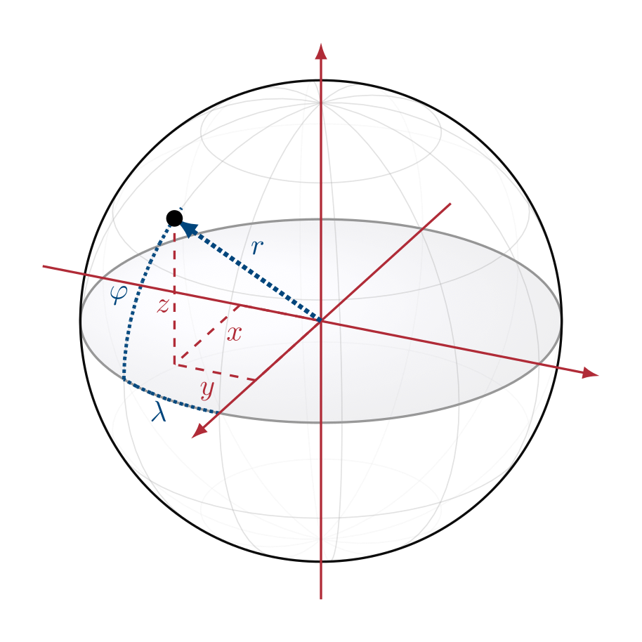
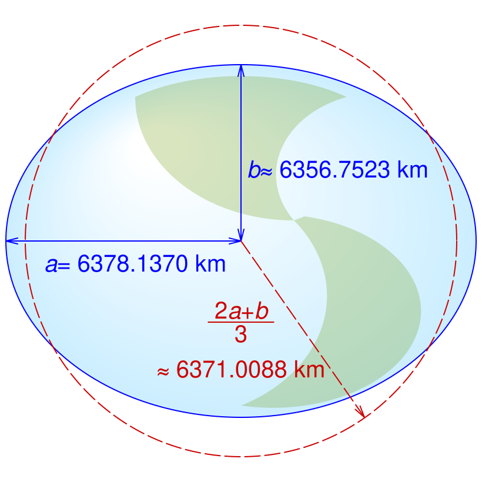
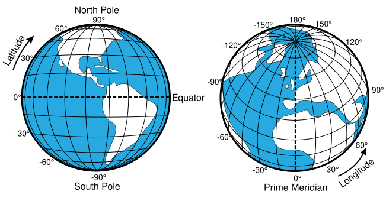
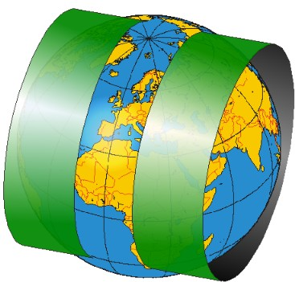
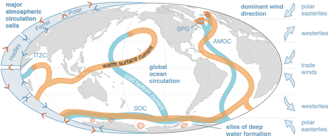
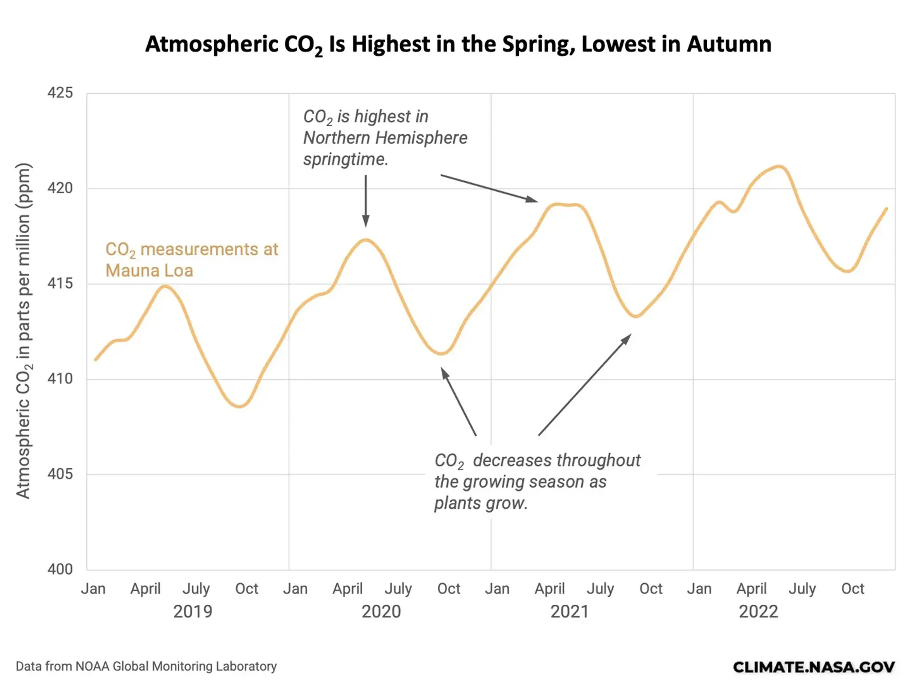

---
addons:
  - "../"
defaults:
  layout: bonn-content
layout: bonn-cover
subhead: Lecture 2
home: ../
---

# Geospatial Data: Sources, Modalities, and Applications

## Geospatial Representation Learning

---

# Learning Outcomes

## Lecture

- Understand and compare major geospatial data sources from GIS, remote sensing, meteorology, geophysics, and environmental monitoring.
- Distinguish common geospatial data modalities, including raster images, vector layers, point data, point clouds, time series, trajectories, and gridded fields.
- Explain key properties of geospatial data, including spatial resolution, temporal resolution, spectral resolution, coverage, uncertainty, and coordinate reference systems.
- Describe common geospatial data formats and access patterns used in Python-based workflows.
- Match geospatial data sources and modalities to suitable environmental and socio-ecological applications.
- Identify practical challenges such as scale mismatch, missing data, sampling bias, spatial autocorrelation, and heterogeneous data quality.

## Lab

- Access and preprocess raster, vector, and time-series geospatial data using Python-based tools.
- Combine multiple geospatial data layers into a common spatial reference and resolution.
- Extract training samples or analysis regions from geospatial datasets.
- Evaluate practical limitations of data quality, coverage, scale, and interoperability.

---
layout: bonn-section
sectionColor: "#f2c300"
section: coordinates
sectionTitle: Coordinates
---

# Coordinates

<a href="https://saylordotorg.github.io/text_essentials-of-geographic-information-systems/s05-03-geographic-information-systems.html" target="_blank" rel="noopener noreferrer">
Campbell &amp; Shin (2011), Figure 1.8.
</a>

---

# Coordinates and Location

<blockquote>
How many coordinates do we need to uniquely define a spatio-temporal location?
</blockquote>

<h3>3 spatial dimensions</h3>

Cartesian (x, y, z) or  Spherical/Ellipsoidal (λ, φ, r) or or UTM Projections (Easting, Northing, Height)

Where is it in space?

<h3>1 temporal dimension</h3>

t

When does it occur?

---

# Cartesian Coordinates x,y,z

###

A location can be represented by three orthogonal coordinates $\mathbf{p} = (x, y, z)$ in an <a href="https://en.wikipedia.org/wiki/Earth-centered,_Earth-fixed_coordinate_system">Earth-Centered, Earth-Fixed (ECEF)</a> coordinate system

  

---

# Spherical Coordinates

###

Expressing location on the surface of Earth is often more practical than working directly in 3D Cartesian coordinates
$
x,y,z \mapsto \lambda, \varphi, r
$
of longitude $\lambda$, latitude $\varphi$, and constant radius $r$

Spherical to Cartesian

$$
x = r \cos\varphi \cos\lambda
$$

$$
y = r \cos\varphi \sin\lambda
$$

$$
z = r \sin\varphi
$$

Cartesian to spherical

$$
r = \sqrt{x^2 + y^2 + z^2}
$$

$$
\lambda = \operatorname{atan2}(y, x)
$$

$$
\varphi = \arcsin\left(\frac{z}{r}\right)
$$

  

---

# Ellipsoidal Coordinates

###

But the Earth is not a sphere: It is an ellipsoid.

Geodetic to Cartesian

$$
\begin{aligned}
x &= (N(\varphi) + h)\cos\varphi\cos\lambda \\
y &= (N(\varphi) + h)\cos\varphi\sin\lambda \\
z &= \left((1-e^2)N(\varphi) + h\right)\sin\varphi
\end{aligned}
$$

$$
\begin{aligned}
N(\varphi) &= \frac{a}{\sqrt{1-e^2\sin^2\varphi}} \\
e^2 &= \frac{a^2-b^2}{a^2}
\end{aligned}
$$

Cartesian to Geodetic

The inverse is usually computed iteratively. See
<a href="https://en.wikipedia.org/wiki/Geographic_coordinate_conversion#From_ECEF_to_geodetic_coordinates" target="_blank" rel="noopener noreferrer">
Wikipedia
</a>.

  

--- 

# World Geodetic System 1984 (WGS 84)

###

WGS 84 is the global reference system used by GPS and most web mapping workflows.

  

  

  

---

# Cylindrical Map Projections and Web Mercator

### Cylindrical projections - Mercator

A cylinder touches or cuts the globe along a line or lines. The classic case is a cylinder around the equator.

  

<blockquote style="margin-top: auto; min-height: 3.1rem;">
Cylindrical projections minimize distortion along their standard line(s).
</blockquote>

### Web Mercator

Web Mercator is the projection used by many web maps. It is a cylindrical, conformal projection: local shapes are preserved, but areas grow strongly toward the poles.

<blockquote style="margin-top: auto; min-height: 3.1rem;">
Web maps trade area accuracy for visually stable local shapes and simple tiled rendering.
</blockquote>

---

# Cylindrical Map Projections and UTM

### Cylindrical projections - UTM

The Universal Transverse Mercator system rotates the cylinder: each zone uses a transverse cylinder around a local central meridian.

  

<blockquote style="margin-top: auto; min-height: 3.1rem;">
UTM turns longitude/latitude into local metric coordinates: easting and northing.
</blockquote>

### Universal Transverse Mercator (UTM)

Pre-defined UTM zones give geodata local coordinate systems with comparatively low distortion inside each zone.

  

<blockquote style="margin-top: auto; min-height: 3.1rem;">
UTM uses different cylinders to avoid local distortions.
</blockquote>

---

# Radius: Atmosphere and Ocean

Geospatial fields are not only horizontal.

They also vary vertically:

- wind fields change across atmospheric columns
- ocean currents differ at the surface and at depth
- temperature, humidity, pressure, and salinity depend on height or depth
- many Earth-system processes require a vertical coordinate

<blockquote>
Location often means latitude, longitude, and height or depth.
</blockquote>

  

  
  

  

  Figure: University of Exeter, <a href="https://commons.wikimedia.org/wiki/File:Fig_1.4.1_Atmospheric_circulation_cells,_dominant_wind_directions.png" target="_blank" rel="noopener noreferrer"><em>Atmospheric circulation cells, dominant wind directions, key ocean basins, surface currents and deep water formation sites</em></a>. Licensed under CC-BY-SA: Creative Commons Attribution-Share Alike 4.0 International. The rest of this slide deck remains CC-BY-NC.
  

---

# Time: The Earth is Dynamic

  
  

  Figure: NASA Science, <a href="https://science.nasa.gov/earth/explore/earth-indicators/carbon-dioxide/" target="_blank" rel="noopener noreferrer">Carbon Dioxide</a>.
  

  
  

  Figure: Google Earth Engine, <a href="https://developers.google.com/earth-engine/tutorials/community/modis-ndvi-time-series-animation" target="_blank" rel="noopener noreferrer">MODIS NDVI time series animation</a>. Licensed under CC-BY.
  

---

# Time: Common Frequencies

###

Earth observations contain processes at many characteristic temporal frequencies.

| Time scale | Frequency | Examples |
|---|---|---|
| Seconds to minutes | High frequency | Wind gusts, turbulence, lightning, traffic, waves, sensor noise |
| Minutes to hours | Sub-daily | Cloud motion, precipitation cells, tides, urban mobility, river discharge |
| ~12 hours | Semi-diurnal | Ocean tides, coastal water levels |
| 24 hours | Daily / diurnal | Temperature cycle, solar radiation, human activity, vegetation |
| Several days | Weather | Storms, pressure systems, cloud regimes, heatwaves, cold fronts |
| Weekly | Anthropogenic | Commuting, energy use, shipping patterns, some air pollution signals |
| Monthly / ~29.5 days | Lunar | Spring-neap tide cycle, moon-related illumination effects |
| Seasonal / annual | Yearly | Phenology, crop cycles, snow cover, monsoon, sea ice, temperature |
| Interannual | 2-7 years | ENSO / El Nino, drought cycles, vegetation anomalies |
| Decadal | 10+ years | Climate variability, land-use change, glacier retreat, urban expansion |
| Multi-decadal to centennial | Long-term trend | Climate change, sea-level rise, ecosystem shifts |

---
layout: bonn-cover
subhead: Practical 2
home: ../
---

# Working with Geospatial Data Sources

## Geospatial Representation Learning
