---
addons:
  - "../"
defaults:
  layout: bonn-content
layout: bonn-cover
subhead: Lecture 3
home: ../
---

<script setup>
import ArrowLabel from './components/ArrowLabel.vue'
import BadgeLabel from './components/BadgeLabel.vue'
import ConnectorDot from './components/ConnectorDot.vue'
import FormulaBox from './components/FormulaBox.vue'
import LatentVector from './components/LatentVector.vue'
import ModelBlock from './components/ModelBlock.vue'
import TensorBox from './components/TensorBox.vue'
</script>

# Machine Learning & Deep Learning Foundations

## Geospatial Representation Learning

<!-- Source adaptation notes: curated from 2025_08_27_Sopron_Architectures.pdf and 2025_08_27_Sopron_Training.pdf. Do not mention source venue in visible slide content. -->

---
section: opening
sectionTitle: Opening
---

# Today In One Sentence

Deep learning learns useful tensor transformations from data.

<div class="grid grid-cols-3 gap-5 mt-8">
<div class="border rounded-xl p-4">
<div class="font-bold text-blue-800">Inputs</div>
<div class="mt-2">geospatial tensors</div>
</div>
<div class="border rounded-xl p-4">
<div class="font-bold text-blue-800">Models</div>
<div class="mt-2">architectures with parameters</div>
</div>
<div class="border rounded-xl p-4">
<div class="font-bold text-blue-800">Learning</div>
<div class="mt-2">optimization from examples</div>
</div>
</div>

---

# Why This Lecture Matters

Later course topics reuse the same foundation:

<div class="grid grid-cols-2 gap-5 mt-8">
<div class="border rounded-xl p-4">self-supervised learning</div>
<div class="border rounded-xl p-4">multimodal foundation models</div>
<div class="border rounded-xl p-4">Earth embeddings</div>
<div class="border rounded-xl p-4">location encoders</div>
<div class="border rounded-xl p-4">implicit neural representations</div>
<div class="border rounded-xl p-4">geospatial AI agents</div>
</div>

<div class="mt-8">
The vocabulary begins with tensors, architectures, losses, gradients, and generalization.
</div>

---
dragPos:
  test-formula: 276,318,128,72
  test-latent-vector: 460,182,134,78
  test-arrow-z: 539,346,88,36
  test-encoder: 624,90,152,87
  test-arrow-encode: 683,340,88,36
  test-badge: 106,341,64,18
  test-input-tensor: 264,194,134,86
  test-node-z: 94,253,22,22
  test-node-x: 178,209,22,22
---

# Test Figure: Manual Assembly

This slide is a sandbox for reusable draggable figure elements.

<TensorBox v-drag="'test-input-tensor'" label="Input Image" shape="[H × W × 13]" icon="🛰️" variant="input" caption="Sentinel-2 patch" />

<ArrowLabel v-drag="'test-arrow-encode'" label="encode" />

<ModelBlock v-drag="'test-encoder'" title="Encoder" subtitle="fθ" icon="🧠" variant="encoder" :chips="['Conv', 'ReLU', 'Pool']" />

<ArrowLabel v-drag="'test-arrow-z'" label="embedding" />

<LatentVector v-drag="'test-latent-vector'" label="z" :length="10" caption="learned representation" variant="latent" />

<FormulaBox v-drag="'test-formula'" label="Model" formula="z = fθ(x)" caption="plain text formula box" />

<BadgeLabel v-drag="'test-badge'" text="v-drag test" variant="accent" />

<ConnectorDot v-drag="'test-node-x'" label="x" />

<ConnectorDot v-drag="'test-node-z'" label="z" variant="accent" />

---

# Lecture Structure

<div class="grid grid-cols-5 gap-3 mt-8 text-center">
<div class="border rounded-xl p-3 bg-blue-50">
<div class="font-bold text-blue-800">1</div>
<div class="mt-2">Opening and geodata recap</div>
</div>
<div class="border rounded-xl p-3">
<div class="font-bold text-blue-800">2</div>
<div class="mt-2">Evolution of deep learning</div>
</div>
<div class="border rounded-xl p-3">
<div class="font-bold text-blue-800">3</div>
<div class="mt-2">Deep model architectures</div>
</div>
<div class="border rounded-xl p-3">
<div class="font-bold text-blue-800">4</div>
<div class="mt-2">Learning algorithms</div>
</div>
<div class="border rounded-xl p-3">
<div class="font-bold text-blue-800">5</div>
<div class="mt-2">Wrapup and course bridge</div>
</div>
</div>

---

# Recap: Geodata Is Structured

From Lecture 2:

<div class="grid grid-cols-2 gap-6 mt-6">
<div>

- spatial reference
- spatial resolution
- temporal resolution
- spectral resolution
- uncertainty and missingness
- sampling bias

</div>
<div class="border rounded-xl p-5 bg-slate-50">

Deep learning does not remove these properties.

It consumes them through tensor representations and inherits their biases.

</div>
</div>

---

# Tensors: The Common Interface

A tensor is a multi-dimensional array.

<div class="grid grid-cols-2 gap-6 mt-5 items-center">
<div>
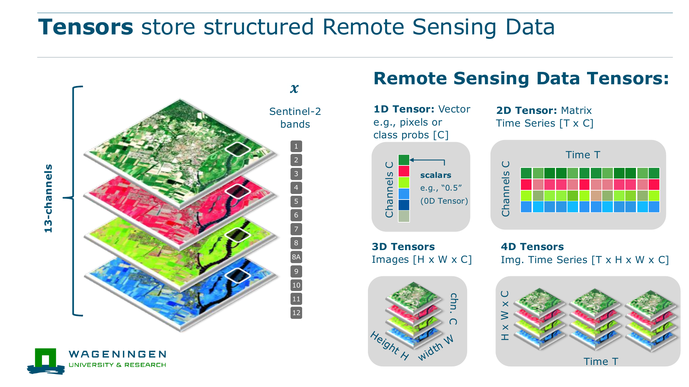
</div>
<div>

Common tensor forms:

- scalar: one value
- vector: one spectrum or feature vector
- matrix: one raster band
- image tensor: `[H x W x C]`
- time series: `[T x C]`
- image time series: `[T x H x W x C]`

</div>
</div>

---

# Pixel Spectrum

One multispectral pixel is a vector.

$$
x_{pixel} =
\begin{bmatrix}
B02 & B03 & B04 & B08 & B11 & B12
\end{bmatrix}
$$

<div class="mt-8 border rounded-xl p-5 bg-slate-50">

The values are numbers for the model, but we interpret them as physical measurements related to vegetation, water, soil, snow, or built surfaces.

</div>

---

# Image Tensor

A multispectral image patch is often:

$$
x \in \mathbb{R}^{H \times W \times C}
$$

<div class="grid grid-cols-3 gap-4 mt-8 text-center">
<div class="border rounded-xl p-4"><div class="text-2xl font-bold text-blue-800">H</div><div class="mt-2">rows</div></div>
<div class="border rounded-xl p-4"><div class="text-2xl font-bold text-blue-800">W</div><div class="mt-2">columns</div></div>
<div class="border rounded-xl p-4"><div class="text-2xl font-bold text-blue-800">C</div><div class="mt-2">bands or channels</div></div>
</div>

---

# Time And Space Together

Repeated observations add a temporal axis.

$$
x \in \mathbb{R}^{T \times H \times W \times C}
$$

<div class="grid grid-cols-4 gap-3 mt-8 text-center">
<div class="border rounded-xl p-3">April</div>
<div class="border rounded-xl p-3">May</div>
<div class="border rounded-xl p-3">June</div>
<div class="border rounded-xl p-3">July</div>
</div>

<div class="mt-8">
This is common in crop mapping, forest monitoring, flood mapping, and land-cover change detection.
</div>

---

# Learning Means Tensor Transformation

A deep model maps an input tensor to an output tensor.

$$
\hat{y} = f_W(x)
$$

<div class="grid grid-cols-2 gap-6 mt-6 items-center">
<div>

- `x`: input tensor
- `f_W`: model with learned parameters
- `ŷ`: prediction tensor

</div>
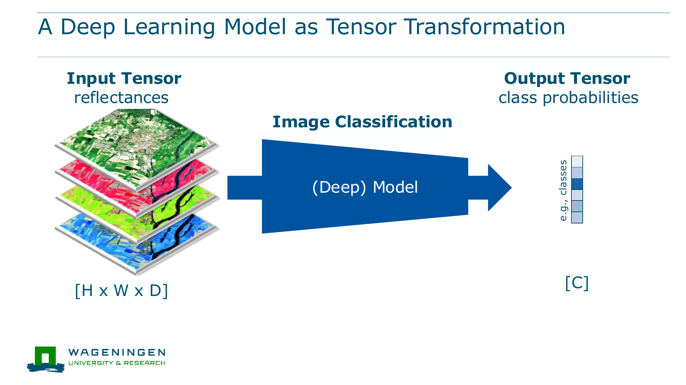
</div>

---

# Opening Takeaway

Deep learning for geospatial data begins with a simple abstraction:

> geospatial measurements become tensors, and models learn transformations between tensors.

Everything else today explains what those transformations look like and how they are learned.

---
section: evolution
sectionTitle: Evolution
---

# Why Deep Learning Emerged

Classic machine learning and deep learning differ in where design knowledge is placed.

<div class="grid grid-cols-2 gap-6 mt-6 items-center">
<div>

Classic ML:

`features → classifier`

Deep learning:

`representation learning → prediction`

</div>
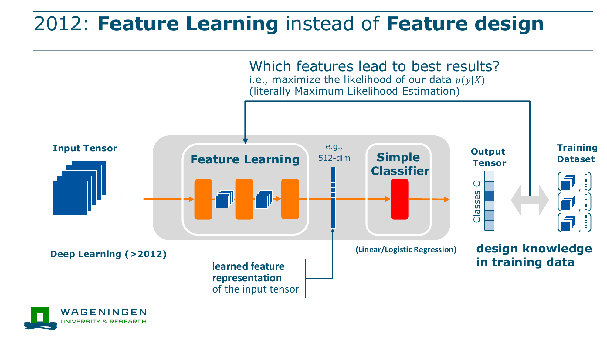
</div>

---

# Before 2012: Classic ML

Remote sensing used many hand-designed features.

<div class="grid grid-cols-2 gap-5 mt-8">
<div class="border rounded-xl p-4">
<div class="font-bold text-blue-800">Spectral indices</div>
<div class="mt-2">NDVI, NDWI, NDBI</div>
</div>
<div class="border rounded-xl p-4">
<div class="font-bold text-blue-800">Texture features</div>
<div class="mt-2">local spatial structure</div>
</div>
<div class="border rounded-xl p-4">
<div class="font-bold text-blue-800">Classifiers</div>
<div class="mt-2">SVMs, random forests, logistic regression</div>
</div>
<div class="border rounded-xl p-4">
<div class="font-bold text-blue-800">Strength</div>
<div class="mt-2">effective with small labelled datasets</div>
</div>
</div>

---

# Classic ML Limitation

Feature design is powerful, but manual.

<div class="mt-8 border rounded-xl p-6 bg-slate-50">

If the relevant pattern is complex, the modeller must already know how to express it as a feature.

</div>

<div class="mt-8">
Examples: crop phenology, urban morphology, flood context, forest structure, multimodal sensor interactions.
</div>

---

# 2015 Onwards: Supervised Deep Learning

Deep networks learn features from labelled data.

<div class="grid grid-cols-3 gap-5 mt-8">
<div class="border rounded-xl p-4">
<div class="font-bold text-blue-800">More data</div>
<div class="mt-2">large labelled benchmarks</div>
</div>
<div class="border rounded-xl p-4">
<div class="font-bold text-blue-800">More compute</div>
<div class="mt-2">GPU training</div>
</div>
<div class="border rounded-xl p-4">
<div class="font-bold text-blue-800">Better architectures</div>
<div class="mt-2">CNNs, ResNets, Transformers</div>
</div>
</div>

---

# Supervised Deep Learning Workflow

<div class="grid grid-cols-7 gap-2 mt-8 text-center items-center">
<div class="border rounded-xl p-3">input</div>
<div>→</div>
<div class="border rounded-xl p-3">deep model</div>
<div>→</div>
<div class="border rounded-xl p-3">prediction</div>
<div>→</div>
<div class="border rounded-xl p-3">loss</div>
</div>

<div class="mt-8">
The labelled dataset tells the model what predictions should look like.
</div>

---

# From Labels To Pretraining

Labelled data is expensive in geospatial domains.

<div class="grid grid-cols-2 gap-6 mt-6 items-center">
<div>

Manual labels may require:

- expert interpretation
- field campaigns
- harmonized taxonomies
- temporal alignment
- quality control

</div>
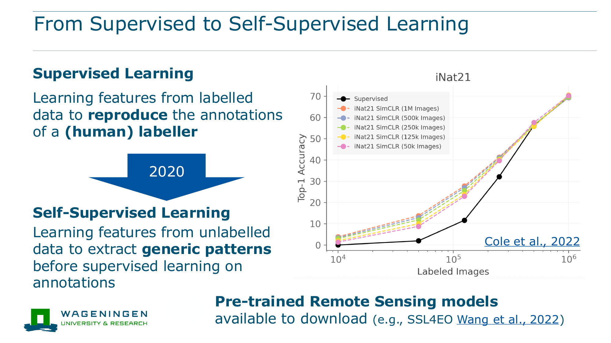
</div>

---

# Self-Supervised Learning

Self-supervised learning learns from structure in unlabelled data.

<div class="grid grid-cols-2 gap-8 mt-8">
<div class="border rounded-xl p-5">
<div class="font-bold text-blue-800">Supervised</div>
<div class="mt-2">match human-provided labels</div>
</div>
<div class="border rounded-xl p-5">
<div class="font-bold text-blue-800">Self-supervised</div>
<div class="mt-2">solve a pretext task from the data itself</div>
</div>
</div>

<div class="mt-8">
This is the bridge to foundation models in Lecture 4.
</div>

---

# Evolution Takeaway

The evolution is a shift in what we design.

<table class="mt-6">
<thead>
<tr><th>Period</th><th>Main design effort</th><th>Typical data</th></tr>
</thead>
<tbody>
<tr><td>Classic ML</td><td>features</td><td>small labelled datasets</td></tr>
<tr><td>Supervised DL</td><td>architectures</td><td>large labelled datasets</td></tr>
<tr><td>Self-supervised DL</td><td>objectives</td><td>large unlabelled or multimodal archives</td></tr>
</tbody>
</table>

---
section: architectures
sectionTitle: Architectures
---

# Part 1: Deep Model Architectures

Architecture answers:

> How should a model transform tensors?

<div class="grid grid-cols-3 gap-5 mt-8">
<div class="border rounded-xl p-4">building blocks</div>
<div class="border rounded-xl p-4">network families</div>
<div class="border rounded-xl p-4">inductive biases</div>
</div>

---

# Architecture Families

<div class="grid grid-cols-2 gap-6 mt-5 items-center">
<div>

Today we focus on:

- MLPs
- CNNs
- Transformers

Each family makes different assumptions about the input tensor.

</div>
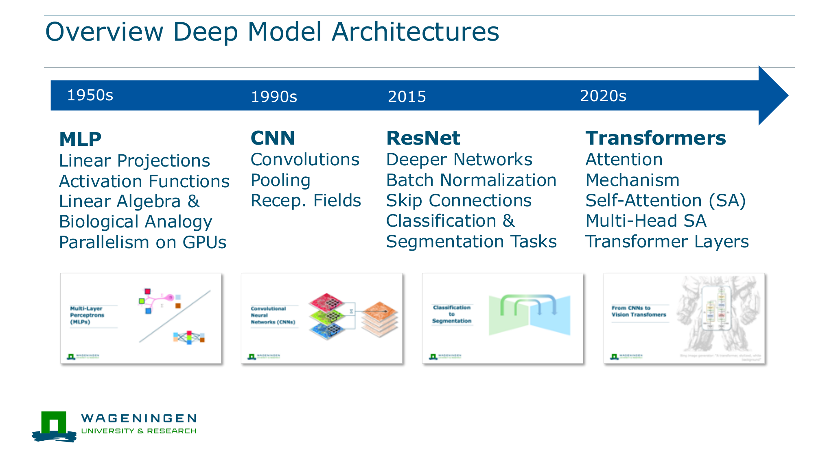
</div>

---

# Parameters

Parameters are the numbers the model learns.

<div class="grid grid-cols-2 gap-8 mt-8">
<div class="border rounded-xl p-5 bg-slate-50">

Before training:

`W` is mostly random.

</div>
<div class="border rounded-xl p-5 bg-slate-50">

After training:

`W` contains useful transformations.

</div>
</div>

---

# Linear Layer

The basic operation is often:

$$
h = Wx + b
$$

<div class="grid grid-cols-2 gap-6 mt-5 items-center">
<div>

- `x`: input vector
- `W`: weights
- `b`: bias
- `h`: output vector

</div>
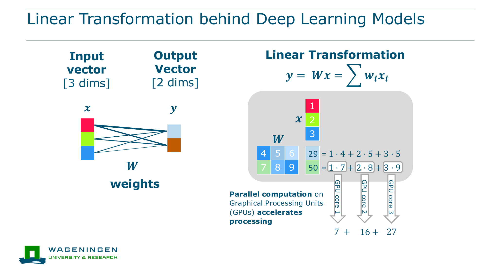
</div>

---

# Bias Term

The bias shifts the output.

$$
h = Wx + b
$$

<div class="mt-8 border rounded-xl p-5 bg-slate-50">

Without `b`, the transformation must pass through the origin. With `b`, the model has more flexibility.

</div>

---

# Activation Function

Activation functions add nonlinearity.

<div class="grid grid-cols-2 gap-8 mt-8">
<div class="border rounded-xl p-5">
<div class="font-bold text-blue-800">Without activations</div>
<div class="mt-2">stacked linear layers collapse into one linear map</div>
</div>
<div class="border rounded-xl p-5">
<div class="font-bold text-blue-800">With activations</div>
<div class="mt-2">networks model complex functions</div>
</div>
</div>

---

# Pooling

Pooling reduces spatial or temporal resolution.

<div class="grid grid-cols-2 gap-8 mt-8">
<div>

Common idea:

`local neighborhood → summary value`

</div>
<div class="border rounded-xl p-5 bg-slate-50">

Pooling can make features less sensitive to small shifts, but it also discards detail.

</div>
</div>

---

# Dropout

Dropout randomly removes activations during training.

<div class="grid grid-cols-2 gap-8 mt-8">
<div class="border rounded-xl p-5">
<div class="font-bold text-blue-800">Goal</div>
<div class="mt-2">reduce dependence on any single feature</div>
</div>
<div class="border rounded-xl p-5">
<div class="font-bold text-blue-800">Use</div>
<div class="mt-2">regularization in neural networks</div>
</div>
</div>

---

# Normalization

Normalization stabilizes training by controlling feature scales.

<div class="grid grid-cols-2 gap-8 mt-8">
<div>

Examples:

- batch normalization
- layer normalization

</div>
<div class="border rounded-xl p-5 bg-slate-50">

Normalization is one reason very deep networks became easier to train.

</div>
</div>

---

# Residual Connections

Residual connections let layers learn changes rather than full transformations.

$$
h_{next} = h + F(h)
$$

<div class="mt-8 border rounded-xl p-5 bg-slate-50">

They help gradients flow through deep networks and are central in ResNets and Transformers.

</div>

---

# Multi-Layer Perceptron

An MLP stacks dense layers.

<div class="grid grid-cols-7 gap-2 mt-8 text-center items-center">
<div class="border rounded-xl p-3">x</div>
<div>→</div>
<div class="border rounded-xl p-3">linear + activation</div>
<div>→</div>
<div class="border rounded-xl p-3">linear + activation</div>
<div>→</div>
<div class="border rounded-xl p-3">ŷ</div>
</div>

<div class="mt-8">
MLPs are useful for vectors: pixel spectra, tabular covariates, coordinates, and embeddings.
</div>

---

# MLP Limitation

An MLP treats its input as a vector.

<div class="mt-8 border rounded-xl p-5 bg-slate-50">

If we flatten an image, the model no longer directly knows which pixels are neighbors.

</div>

<div class="mt-8">
This motivates architectures with spatial structure.
</div>

---

# Convolutional Neural Network

A CNN applies local filters across an image.

<div class="grid grid-cols-2 gap-8 mt-8">
<div>

Key ideas:

- local receptive fields
- shared weights
- feature maps

</div>
<div class="border rounded-xl p-5 bg-slate-50">

CNNs encode the assumption that nearby pixels are related and patterns can repeat across space.

</div>
</div>

---

# CNNs In Remote Sensing

CNNs learn spatial patterns such as:

<div class="grid grid-cols-2 gap-5 mt-8">
<div class="border rounded-xl p-4">field boundaries</div>
<div class="border rounded-xl p-4">building shapes</div>
<div class="border rounded-xl p-4">road networks</div>
<div class="border rounded-xl p-4">urban and forest texture</div>
</div>

---

# Segmentation With CNNs

Semantic segmentation predicts a label for every pixel.

<div class="grid grid-cols-2 gap-6 mt-5 items-center">
<div>

$$
f_W(x): \mathbb{R}^{H \times W \times C}
\rightarrow
\mathbb{R}^{H \times W \times K}
$$

Example: land cover, buildings, roads, water, burned area.

</div>
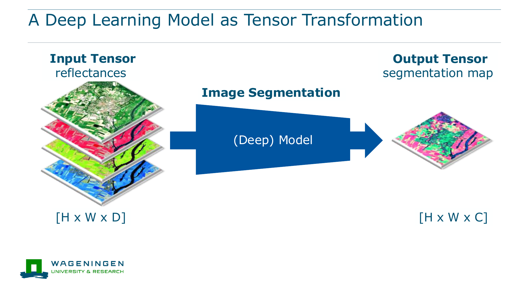
</div>

---

# Transformer Intuition

Transformers process tokens.

<div class="grid grid-cols-5 gap-2 mt-8 text-center">
<div class="border rounded-xl p-3">patch</div>
<div class="border rounded-xl p-3">patch</div>
<div class="border rounded-xl p-3">date</div>
<div class="border rounded-xl p-3">sensor</div>
<div class="border rounded-xl p-3">text</div>
</div>

<div class="mt-8">
Tokens can represent image patches, dates, modalities, coordinates, or words.
</div>

---

# Self-Attention

Self-attention asks:

> Which other tokens are relevant for this token?

<div class="mt-8 border rounded-xl p-5 bg-slate-50">

In geospatial data, attention can connect distant image patches, different dates, or different sensor modalities.

</div>

---

# Transformers In Geospatial AI

Transformers are useful when models must combine:

<div class="grid grid-cols-2 gap-5 mt-8">
<div class="border rounded-xl p-4">image patches</div>
<div class="border rounded-xl p-4">time series</div>
<div class="border rounded-xl p-4">optical, SAR, climate, metadata</div>
<div class="border rounded-xl p-4">text and task descriptions</div>
</div>

---

# Architecture Comparison

<table class="mt-6">
<thead>
<tr><th>Architecture</th><th>Input assumption</th><th>Geospatial fit</th></tr>
</thead>
<tbody>
<tr><td>MLP</td><td>vector features</td><td>spectra, tabular covariates, embeddings</td></tr>
<tr><td>CNN</td><td>local spatial structure</td><td>image classification and segmentation</td></tr>
<tr><td>Transformer</td><td>token interactions</td><td>temporal, multimodal, foundation models</td></tr>
</tbody>
</table>

---

# Architecture Takeaway

Architectures are not only implementation details.

They encode assumptions about what structure matters:

<div class="grid grid-cols-3 gap-5 mt-8">
<div class="border rounded-xl p-4">vectors</div>
<div class="border rounded-xl p-4">local neighborhoods</div>
<div class="border rounded-xl p-4">global token relations</div>
</div>

---
section: learning
sectionTitle: Learning
---

# Part 2: Learning Algorithms

Now we ask:

> How do the parameters of a deep architecture become useful?

<div class="mt-8">
The answer is optimization from data.
</div>

---

# Supervised Dataset

We start with labelled examples:

$$
\mathcal{D} = \{(x_i, y_i)\}_{i=1}^{N}
$$

<div class="grid grid-cols-2 gap-8 mt-8">
<div class="border rounded-xl p-5">
<div class="font-bold text-blue-800">x_i</div>
<div class="mt-2">input tensor</div>
</div>
<div class="border rounded-xl p-5">
<div class="font-bold text-blue-800">y_i</div>
<div class="mt-2">target or label</div>
</div>
</div>

---

# Prediction And Loss

The model predicts:

$$
\hat{y}_i = f_W(x_i)
$$

The loss measures mismatch:

$$
\mathcal{L}(\hat{y}_i, y_i)
$$

<div class="mt-8 border rounded-xl p-5 bg-slate-50">

Training uses this scalar loss to decide how to update the parameters.

</div>

---

# Cross Entropy

Cross entropy is common for classification.

<div class="grid grid-cols-2 gap-6 mt-5 items-center">
<div>

It penalizes confident wrong predictions strongly.

Example: predicting `urban: 0.95` when the target is `water`.

</div>
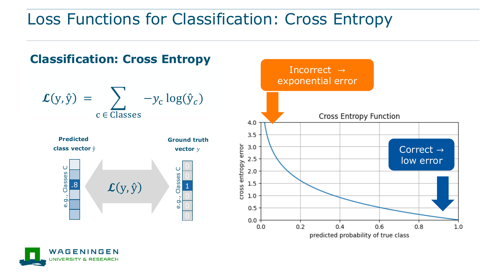
</div>

---

# Mean Squared Error

Mean squared error is common for regression.

<div class="grid grid-cols-2 gap-6 mt-5 items-center">
<div>

$$
\mathcal{L}(\hat{y}, y) = (\hat{y} - y)^2
$$

Example: biomass, soil carbon, temperature, flood depth.

</div>
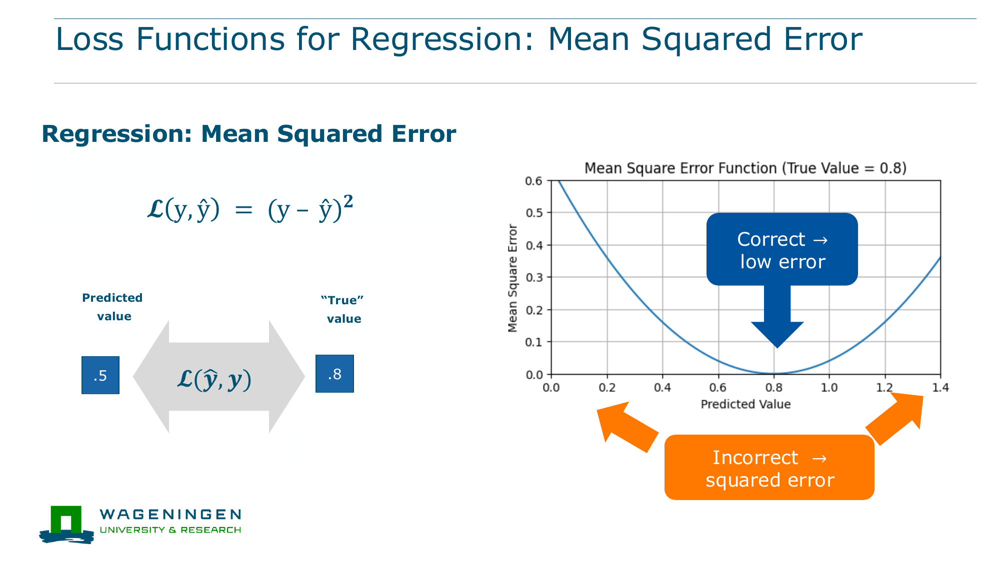
</div>

---

# Training Objective

Training searches for parameters with low loss.

$$
W^* = \arg\min_W \mathcal{L}(f_W(x), y)
$$

<div class="mt-8 border rounded-xl p-5 bg-slate-50">

Read this as: find parameters that make predictions match examples.

</div>

---

# Gradient Descent

Gradient descent updates parameters by moving downhill.

<div class="grid grid-cols-2 gap-6 mt-5 items-center">
<div>

$$
W_{t+1} = W_t - \eta \nabla_W \mathcal{L}
$$

- `η`: learning rate
- `∇L`: direction of steepest increase
- negative sign: move toward lower loss

</div>
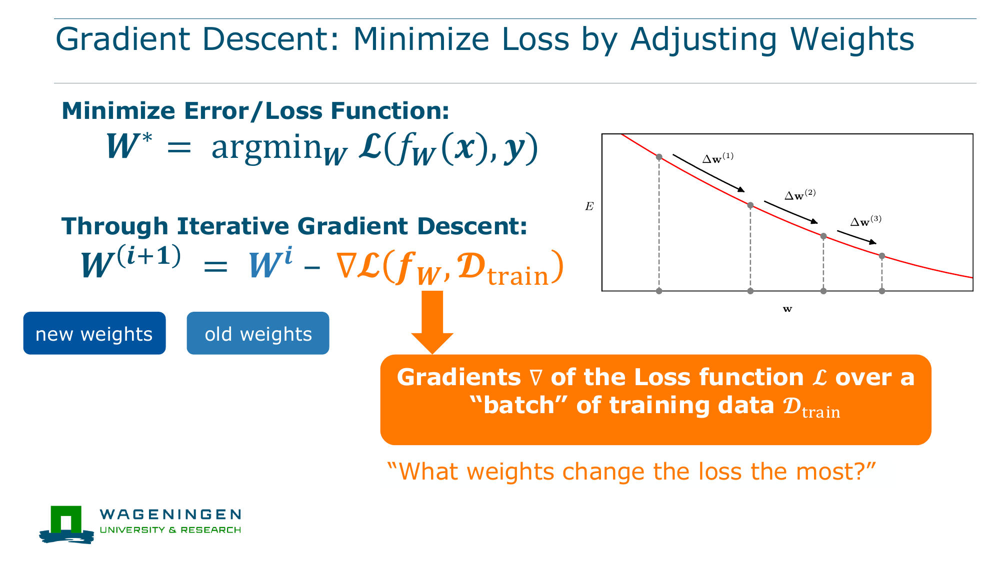
</div>

---

# Loss Surface

The loss changes as parameters change.

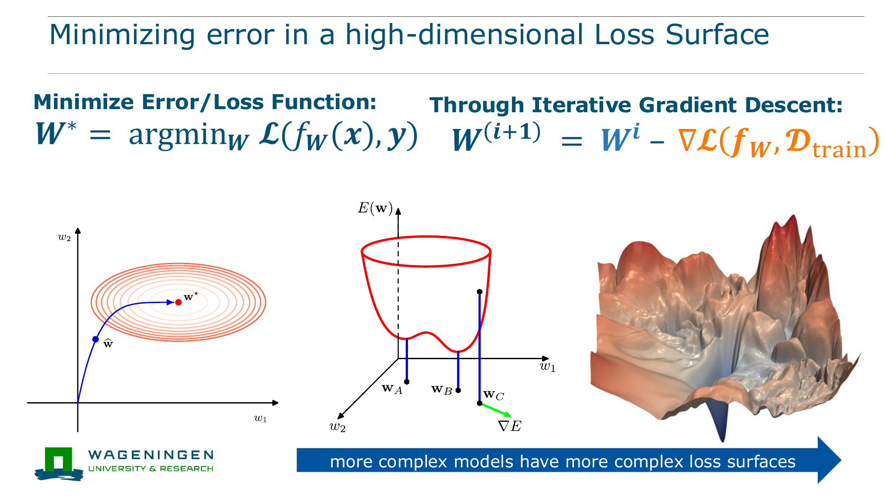

<div class="mt-6">
Deep networks have high-dimensional loss surfaces, not simple two-dimensional hills.
</div>

---

# Learning Rate

The learning rate controls step size.

<div class="grid grid-cols-2 gap-6 mt-5 items-center">
<div class="grid grid-cols-1 gap-3">
<div class="border rounded-xl p-4"><div class="font-bold text-blue-800">Too small</div><div class="mt-2">slow learning</div></div>
<div class="border rounded-xl p-4"><div class="font-bold text-blue-800">Useful range</div><div class="mt-2">steady improvement</div></div>
<div class="border rounded-xl p-4"><div class="font-bold text-blue-800">Too large</div><div class="mt-2">unstable training</div></div>
</div>
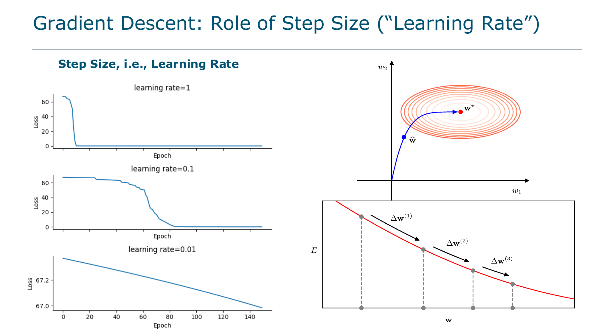
</div>

---

# Backpropagation

Backpropagation computes gradients through many layers.

<div class="grid grid-cols-2 gap-6 mt-5 items-center">
<div>

It applies the chain rule from the loss backward through the computation graph.

This tells each parameter how it influenced the final error.

</div>
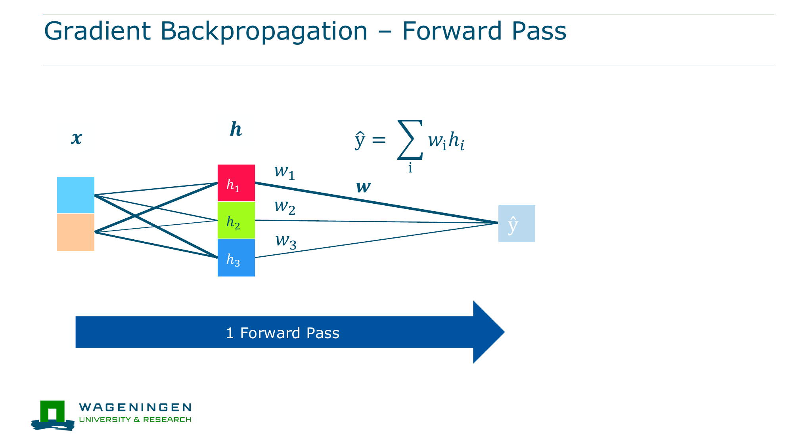
</div>

---

# Minimal PyTorch Loop

```python
y_pred = model(x)
loss = loss_fn(y_pred, y)

loss.backward()
optimizer.step()
optimizer.zero_grad()
```

<div class="mt-6">
This is the operational core of supervised deep learning.
</div>

---

# Train, Validation, Test

<div class="grid grid-cols-3 gap-5 mt-8">
<div class="border rounded-xl p-4">
<div class="font-bold text-blue-800">Training</div>
<div class="mt-2">updates parameters</div>
</div>
<div class="border rounded-xl p-4">
<div class="font-bold text-blue-800">Validation</div>
<div class="mt-2">chooses settings and stopping point</div>
</div>
<div class="border rounded-xl p-4">
<div class="font-bold text-blue-800">Test</div>
<div class="mt-2">estimates final performance</div>
</div>
</div>

---

# Generalization

Generalization means performance on new data.

<div class="grid grid-cols-2 gap-8 mt-8">
<div class="border rounded-xl p-5 bg-slate-50">

Training performance:

how well the model fits seen examples.

</div>
<div class="border rounded-xl p-5 bg-slate-50">

Test performance:

how well the model works on unseen examples.

</div>
</div>

---

# Bias And Variance

<div class="grid grid-cols-2 gap-6 mt-5 items-center">
<div>

<div class="grid grid-cols-2 gap-4">
<div class="border rounded-xl p-5"><div class="font-bold text-blue-800">High bias</div><div class="mt-2">model too simple</div></div>
<div class="border rounded-xl p-5"><div class="font-bold text-blue-800">High variance</div><div class="mt-2">model too sensitive to samples</div></div>
</div>

<div class="mt-6">
Deep models often have enough capacity to overfit.
</div>

</div>
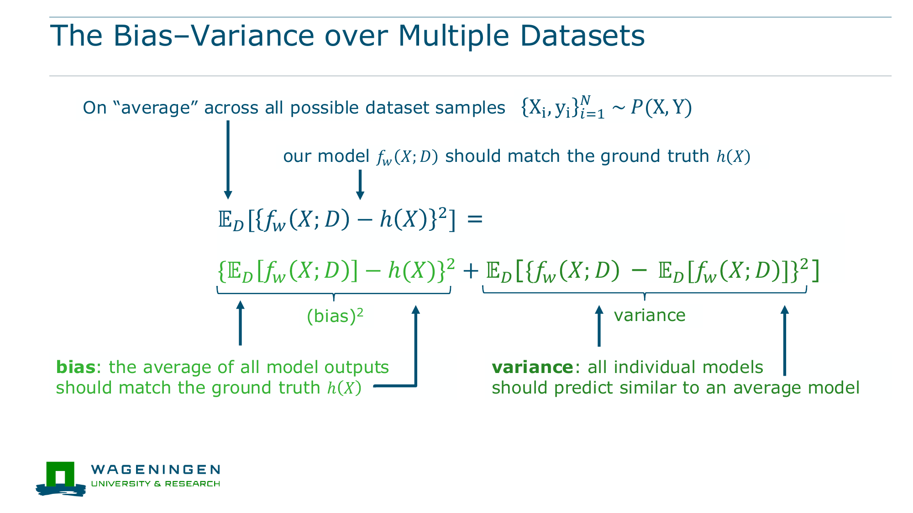
</div>

---

# Regularization

Regularization discourages brittle solutions.

<div class="grid grid-cols-2 gap-6 mt-5 items-center">
<div>

Examples:

- weight decay
- dropout
- data augmentation
- early stopping
- normalization

</div>
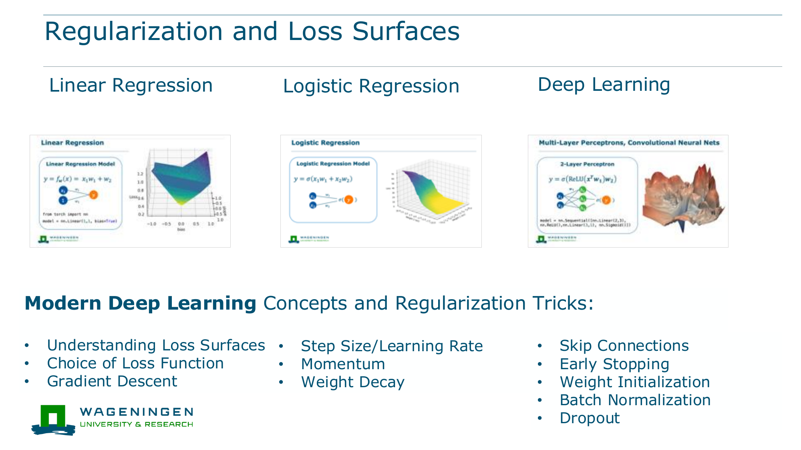
</div>

---

# Geospatial Validation Is Special

Random splits can overestimate performance.

<div class="grid grid-cols-2 gap-8 mt-8">
<div>

Nearby samples often look similar because of spatial autocorrelation.

Random splits can place nearly duplicate landscapes in train and test.

</div>
<div class="border rounded-xl p-5 bg-slate-50">

Spatial, temporal, or region-based splits often provide a more honest estimate of generalization.

</div>
</div>

---

# Distribution Shift

Distribution shift means training and deployment data differ.

$$
p_{train}(x,y) \neq p_{test}(x,y)
$$

<div class="grid grid-cols-2 gap-5 mt-8">
<div class="border rounded-xl p-4">new region</div>
<div class="border rounded-xl p-4">new season or year</div>
<div class="border rounded-xl p-4">new sensor or resolution</div>
<div class="border rounded-xl p-4">new climate or land-use regime</div>
</div>

---

# Geospatial Shift Example

A crop model trained in one region may learn a shortcut.

<div class="grid grid-cols-2 gap-8 mt-8">
<div class="border rounded-xl p-5 bg-slate-50">

Training region:

irrigated cropland has a strong summer green signal.

</div>
<div class="border rounded-xl p-5 bg-slate-50">

New region:

rainfed cropland has different phenology and soils.

</div>
</div>

---

# Learning Takeaway

Learning algorithms connect data, architecture, and objective.

<div class="grid grid-cols-5 gap-2 mt-8 text-center items-center">
<div class="border rounded-xl p-3">data</div>
<div>→</div>
<div class="border rounded-xl p-3">loss</div>
<div>→</div>
<div class="border rounded-xl p-3">gradients</div>
</div>

<div class="mt-8">
The real test is not fitting the training set, but generalizing under geospatial shift.
</div>

---
section: wrapup
sectionTitle: Wrapup
---

# What To Remember

<div class="grid grid-cols-2 gap-6 mt-6">
<div>

- Geodata enters deep learning as tensors.
- Deep learning learns tensor transformations.
- Architectures encode assumptions about structure.
- MLPs, CNNs, and Transformers are different transformation families.

</div>
<div>

- Losses define what "better" means.
- Gradient descent updates parameters.
- Backpropagation computes gradients efficiently.
- Geospatial generalization is dominated by distribution shift.

</div>
</div>

---

# Where This Fits In The Course

<div class="grid grid-cols-5 gap-3 mt-8 text-center">
<div class="border rounded-xl p-3">Geospatial data</div>
<div class="border rounded-xl p-3 bg-blue-50">Deep learning foundations</div>
<div class="border rounded-xl p-3">Self-supervised learning</div>
<div class="border rounded-xl p-3">Earth embeddings</div>
<div class="border rounded-xl p-3">Agents and projects</div>
</div>

<div class="mt-8">
Today gives the machinery. Later lectures ask how to use this machinery to learn reusable geospatial representations.
</div>

---

# Bridge To Foundation Models

Foundation models combine today’s ingredients at larger scale.

<div class="grid grid-cols-3 gap-5 mt-8">
<div class="border rounded-xl p-4">large data</div>
<div class="border rounded-xl p-4">large architectures</div>
<div class="border rounded-xl p-4">pretraining objectives</div>
</div>

<div class="mt-8">
The next lecture focuses on self-supervised and multimodal objectives.
</div>

---

# Next Lecture

Self-Supervised, Multimodal & Foundation Models

<div class="mt-8">
We will ask:
</div>

<div class="grid grid-cols-2 gap-6 mt-6">
<div class="border rounded-xl p-5">How can models learn from unlabelled Earth observation archives?</div>
<div class="border rounded-xl p-5">How do representations transfer across tasks, regions, and sensors?</div>
</div>
